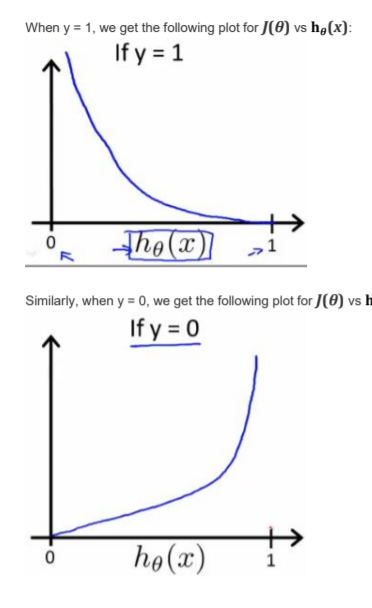

y是离散值 , 即分类问题

从二分类开始学习

- 使用类似线性回归, 比如之前的肿瘤大小和是否良性有关
- 得到线性回归模型 , 然后可取0.5为分界, 二值分类

###### 但是以上假设有问题, 偏离过大的数据会使得线性拟合出现大问题, 因此不建议将线性回归用于分类问题

### logistic回归

分类算法, 并不是回归算法, 命名是历史原因
$$
先介绍sigmoid函数h_\theta(x)=g(\theta^Tx)
$$

使用sigmoid函数而不是线性拟合
$$
g(z)=\frac{1}{1-e^{-z}}\\
z=\theta^Tx
$$

将输出映射到 0-1之间, whenz<0 : y<0.5
$$
即h(\theta)=g(\theta^TX)
$$
代价函数中使用此预估结果去和y做比较

sigmoid不是均值0的函数

#### 模型理解

- 决策边界 

假设拟合模型已做好, 即参数向量已知, 例如
$$
\theta=\begin{matrix}
0\\
0\\
1\\
1\\
\end{matrix}
$$
而特征为 x0, x1, x2平方, x3平方

则决策边界为一个圆

决策边界是一个不等函数, 特征满足某个条件, 二维表现为平面图形, 三维立体图形 某些区域等等

#### 模型拟合

与线性回归同理，找出代价函数（cost function）

回顾线性回归的代价函数:
$$
J(\theta)=\frac{1}{m}\sum_{1}^{m}\frac12(h_\theta(x^i)-y^i)^2
$$
$$
如果使用此代价函数在sigmoid函数的logistic分类上,\\那么J(\theta)将会是非凸函数, 即有多个局部最优解
$$
因此寻找到以下代价函数
$$
\begin{equation}Cost(h_\theta(x),y)=\{
\begin{aligned}
-log(h_\theta(x))\ \ \ if\ \ y=1\\
-log(1-h_\theta(x))\ \ \ if\ \ y=1
\end{aligned}
\end{equation}
$$
直观上的理解, 若 y=1, 而我们的预测 h(θ) = 1 的话, 那么cost(h(θ))-y将为无穷大, 同理若 y=0 而预测为1, 误差也是无穷大, 但误差一般无法降低到0

图像如下

数学证明 此代价函数没有局部最优解

#### 代价函数的简化并使用梯度下降法解决

把两个式子合并成一个(使用 y 只等于1 或者 0 的特点来进行化简)
$$
Cost(h_\theta(x),y)=-ylog(h_\theta(x))-(1-y)log(1-h_\theta(x))
$$
使用极大似然法(概率论与数理统计中学过但是忘了)

得到代价函数的简化
$$
j(\theta)=\frac1m\sum_{i=1}^m[y^ilogh_\theta(x^i)+(1-y^i)log(1-h_\theta(x^i))]
$$
因此梯度下降法中

得到偏导式子为
$$
更新规则看起来和线性回归的式子一样
$$
伪代码为:
$$
repeat\{\\
	\theta j = \theta j-\alpha \frac1m\sum_1^mh_\theta(x^{(i)})-y^{(i)})x^{(i)}\\
\}
$$

到这里就可以实现了

#### 优化算法

Conjugate gradient

BFGS

L-BFGS

能够使用而不需要理解内循环