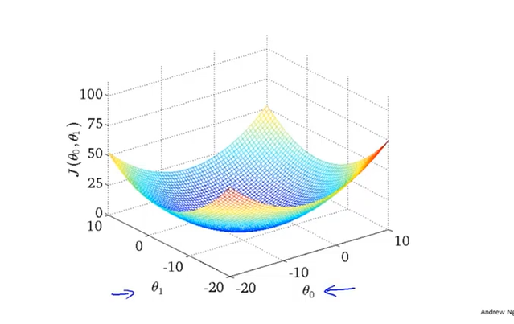
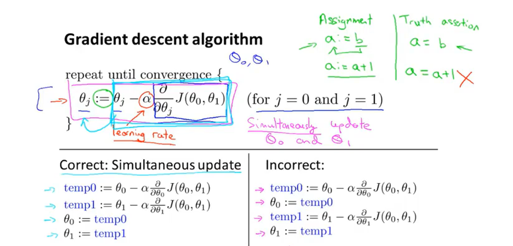

### 单变量线性回归

training Set -> Learning Algorithm -> func(h) module 

然后使用 module 去 predict 一个 数据

y = ax + b

训练集就是确定参数 a 和 b 的数据  fit过程就是使用训练数据来确定

使得误差平方差最小  代价函数
$$
\sqrt{\sum{(h(x^i) - y^i)^2)}}
$$
实际上使用类似
$$
j=\frac{1}{2m}\sum{(h(x^i)-y^i)^2}
$$
优化目标即获得最小的代价函数 即选择合适的参数a,b
$$
minimize(j(a,b))
$$
 一些定义:

Hypothesis(预期函数):
$$
h_{\theta}=\theta_{0}+\theta_1x
$$
Parameters(参数):
$$
\theta_0,\theta_1
$$
Cost Function(代价函数):
$$
j(\theta_0,\theta_1)=\frac{1}{2m}\sum{h_\theta(x^i)-y^i)^2}
$$
Goal(优化目标):
$$
minimizeJ(\theta_0,\theta_1)
$$

#### 梯度下降法

使用偏导

#### 单变量线性回归的梯度下降

$$
\frac{\partial}{\partial\theta_0}J(\theta_0,\theta_1)=\frac1m\sum_i^m(h_\theta(x^{(i)})-y^{(i)})
$$

$$
\frac{\partial}{\partial\theta_j}J(\theta_0...\theta_j)=\frac1m\sum_i^m(h_\theta(x^{(i)})-y^{(i)})*x_j^{(i)}
$$

之前的式子即可

线性回归代价函数是凸函数, 因此没有局部最优解

Python代码已写好, numpy数组十分方便, 主要是数学式子转化为python代码的过程