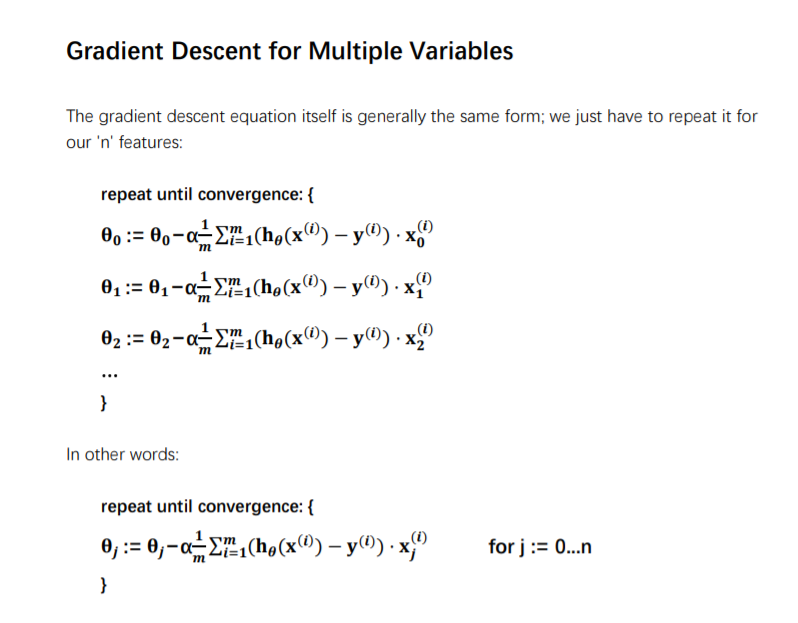
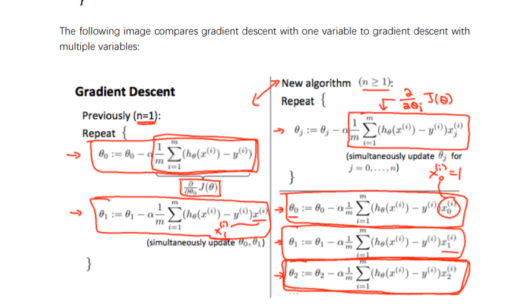

### 定义

变量称为特征, 用数目用n表示
$$
x^{0}->x^{1}...->x^{n}为特征向量
$$

$$
\left[
\begin {matrix}
x^{0}\\
x^{1}\\
x^{2}\\
...\\
x^{n}\\
\end{matrix}
\right]
$$

其中实际共有n-1个特征, x_0 视为1
$$
\left[
\begin {matrix}
\theta^{0}&\theta^{1}&\theta^{2}...&\theta^{n}\\
\end{matrix}
\right]\times\left[
\begin {matrix}
0\\
x^{1}\\
x^{2}\\
...\\
x^{n}\\
\end{matrix}
\right]
$$

$$
h_{0}(x^{1})=\theta_0x_0+\theta_1x_1+...+\theta_nx_n
$$

### 多元梯度下降法

同单变量梯度下降对比

### 数据处理中标准化(均值归一化)的原因

让梯度下降法能够更快的找到局部最优点, 使得让等高线图中环线更接近圆形, 因此能更快找到局部最优点

-- 随机梯度下降法  抽样梯度下降法为大数据量时选用的方法, 并非所有训练数据都用于调整参数

2019年9月8日使用Python代码实现了多元梯度下降, 使用numpy, 没有使用循环即完成了, 但是没有写得过程很混乱, 花了一个多下午才完成, 基本上是在调试改错中完成的, 下次再实现其他算法的时候计划先在纸上画出大概方向再编写代码应该会快很多, 思路也会更加清晰

至于多项式处理方式可以在数据处理的时候完成, 暂时先不实现相关步骤